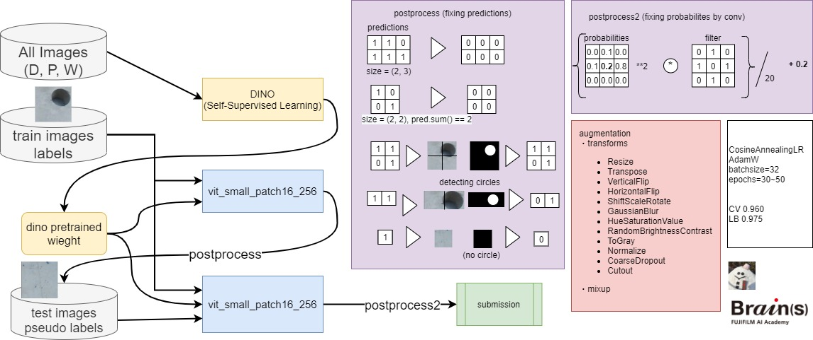

## コンペ概要
コンクリートの画像からPコンと呼ばれる穴があるかどうかを検出する二値分類タスクでした。画像はベースとなる(256x14)x(256x18)の画像から切り取られたもので、学習データとテストデータは3:1で分割されており、右上、右下、左上、左下のどれか1領域がテストデータでした。また、ラベルは非常に偏っていて、学習データの合計が約13000枚に対して、ラベルが1の画像は250枚程度しかありませんでした。
評価指標はf1_scoreでした。

## 解法概要



* 学習全体を通しての設定
- AdamW(lr=1e-3, weight_decay=1e-2)
- CosineAnnealingLR(T_max=epochs)
- BCEWithLogitsLoss
- batch_size: 32
- transforms
  - Resize
  - Transpose
  - VerticalFlip
  - HorizontalFlip
  - ShiftScaleRotate
  - GaussianBlur
  - HueSaturationValue
  - RandomBrightnessContrast
  - ToGray
  - Normalize
  - CoarseDropout
  - Cutout
  
|model|CV|LB|
|:-|:-|:-|
|vit_small+dino|0.899|0.929|
|vit_small+dino+pseudo_labeling|0.960|0.965|
|vit_small+dino+pseudo_labeling+postporcess||0.975|
|resnet18d(参考)|0.769||
|efficientnet_b0(参考)|0.810||
|efficientnet_b0+FPN+aux_loss(参考)|0.892|0.904|
|vit_small+imagenet_pretrained(参考))|0.91|4|


* Self-Supervised Learning
imagenetのpretrainedが禁止ということで、配布画像でself-supervised learningをしてpretrainedを作成。
このコンペの直前に参加していたatmaCupでもimagenetのpretrainedが禁止されており、上位陣が使っていた[DINO](https://arxiv.org/abs/2104.14294)で1000 epoch学習。

* 学習
- [DINO](https://arxiv.org/abs/2104.14294)で得られた重みを初期値として学習
- 30 epoch


* postprocess
- 1と予測した領域の面積で予測を補正
- 大きすぎる場合は予測を0に変換
- それ以外の場合で、円を検出できなかった領域は予測を0に変換
- 主にFPを減らすことを重視

* Psudo Labeling
- postprocessで得られたテストデータの予測を入れて学習
- 50 epoch
- mixup=True


* postprocess2
- Pseudo Labelingで学習した結果に適用
- 予測確率の上下左右の値をconv2dで修正
- もとの予測確率と足し合わせる


学習
```
cd dino
sh train_vit_small_256.sh
```

学習&推論
```
cd ../q2
python train.py config/exp015.yml
python inference.py config/exp015.yml
python scr/postprocess.py exp015
```

学習&推論
```
python train.py config/exp033.yml
python inference.py config/exp033.yml
python scr/postprocess2.py exp033
```


## 効いたこと
* pseudo labeling
* ToGray()
* postprocessing
* vit+DINO

## 効かなかったこと
* CNN系モデル(efficientnet, resnet)
* segmentation(Unet, FPN + embedding層にBCE、200epoch学習させたが、vitの30epochに及ばなかった)
* DiceLoss
* Simsiam
* 結合後の画像をさらに細かく分割して推論
* 結合させた画像をCropして学習

## 効いたかどうかわからないこと
* vitのbackboneの学習率を下げる
* vitの解像度を224から256に上げたこと

## やりたかったけどできなかったこと
* [EsViT](https://arxiv.org/abs/2106.09785v1)(swin_transformer)、学習が遅くて間に合わないだろうと判断
* DINOのpatch_sizeを下げる、DINOの論文によると、patch_sizeを上げるとよくなるが、多くのメモリが必要とあり、patch_sizeを8にして見ると1epochに12分かかり断念
* アンサンブル